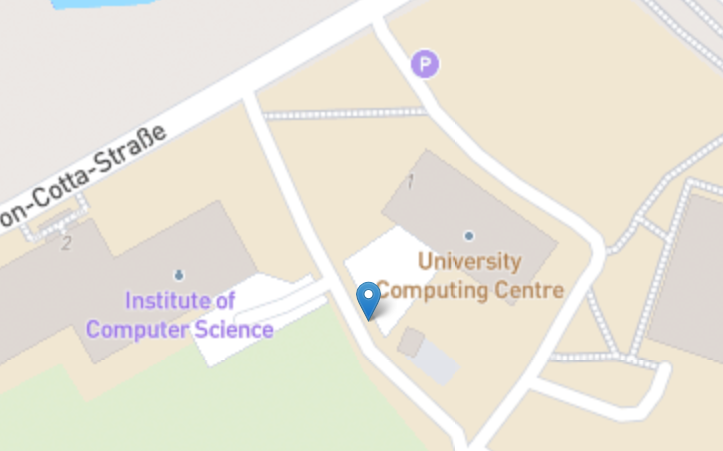

# Participation in the final user study


Thank you for participating in this user study.
I would appreciate it, if you could answer some questions after experiencing the web-app.

Start by exploring the web-app and its functionality.
You can explore the site by yourself or you can stick to the tasks roadmap below, which gives you an overview over the main functions.

## Getting Started

### Setting up the environement

I prepared a docker image for the simulation container and shared the image as a .tar.
Download the image from the [ificloud](https://ificloud.xsitepool.tu-freiberg.de/index.php/f/22320266) as well as the navigation folder (it contains waypoints and parameters).
Place the navigation folder in your home directory or modify the docker-compose.yaml accordingly.
Then load the image from the tar file and start the container.

```bash
docker load -i rimco-simulation-image.tar

docker run -itd --name rimco-simulation --network host nfriedrich/rimco-simulation:latest
```
:warning: Setting the name is very important as it is used in a "little workaround" to fix a problem.


* Clone this project
* Start the UI server

```bash
git clone https://github.com/nfriedrich00/rimco.git -b user_tests

cd rimco
docker compose up --build
```

* Load the simulation image
* Start the simulation container


You might also want to add a mapbox api key to the `ui/.env` file.
Otherwise it will use the osm tiles server, which only supports a lower max zoom level.
DM me for personalized api key.

Then create the `ui/.env` file and add `VITE_MAPBOX_TOKEN=pk.eyJ1Ij...` to it.

## Exploring the UI

Go to http://localhost:5173 to explore the UI.

### Tasks

You can follow these tasks to explore the main functions of the UI by trying out a common use case for the robot.

#### Prepare the software

Start with turning on all necessary sensors and components for the navigation as well as other desired sensors.

<details>
<summary>Click for details</summary>

Start the simulation environment by following these steps:

1. The simulation should reflect the robot's behavior.
This means, the necessary sensors and the localization start automatically.
Not the navigation.
Some sensors may fail to start or don't work as intended, in which case we need to restart them manually.
This would be the job of the monitoring or launch system on the robot, NOT the job of the UI to do it automatically.
But we can restart it from the UI.

2. For the navigation we need the gnss sensor, in the case of the real robot the livox sensors for at least one reading, and the localization.

</details>

#### Visualize some data

Before driving outside, let's check the battery status, which is published on the `battery_percentage` topic.

#### Let the robot drive

When everything is fine, start the demo route for the waypoint following.
For this to work, we first need to manually move the robot to near the starting point and orientation (this is a limitation with the robot's software, not the UI).

While inside, steer the robot manually to the door to prevent obstacles or triggering the emergency stop.

When outside, we can rely on the navigation to drive the robot to the starting point, as long as there are no obstacles on the route.
You could pick a goal or keep steering manually.

The image below shows the starting position for the demo route.
For the navigation to work, the robot should be facing roughly to the south or east.

<details>
<summary>Click for additional infos</summary>

This is because the nav2 controller doesn't find a valid route if there is a significant deviation between the orientation of the robot and the path.
We can start the navigation anyways but it might never succeeds, in which case we could just restart the navigation component.

</details>




When we are near the the starting point for the demo route, we can launch the waypoint following.
There is another demo route near Haus Formgebung, which you could try out as well.
However, this probably won't work until the robot is near the starting point, which you could easily find without help just by using the UI.


## Feedback

After exploring the UI, I would like you to answer some questions about your experience and your thoughts.
Precisely, the SUS and QED questionnaire.
You could just send me the answers but I also prepared a feedback page, which you can find on http://localhost:5173/evaluation


## Help/Troubleshooting/Known problems

When working with this UI, we have to handle problems and bugs of the UI and server but also unexpected behavior from ros2 (especially the rmw) and gazebo and limitations of the real robot's software structure.

Some limitations of the UI and the robot are known.
Some other problems and bugs still need to be discovered.
I would appreciate to receive feedback on these problems, both via text messages and issues on github. 

### Test environment

The simulation seems to be working quite reliably but it might be necessary to restart gazebo, which is possible from the UI.
If this doesn't help, try restarting the simulation docker container.
This should also help when encountering other unexpected problems (please report them!).

The rpp controller doesn't always find a valid plan, in which case the robot gets stuck in endless spin-recovery attempts (without success).
This can almost always be prevented by moving the robot manually near the starting point and orientation (according to the global localization).

### UI

In some cases the `Monitoring` page doesn't show anything for a long time. This can be the case when loading the page for the first time, in which case reloading the page helps.

When reloading the webpage, it might take a while for the components on the `Component control` page to appear.


## Authors

[Nils Friedrich](mailto:nils-jonathan.friedrich@informatik.tu-freiberg.de)

## Version History

* 0.1
    * Initial Release
